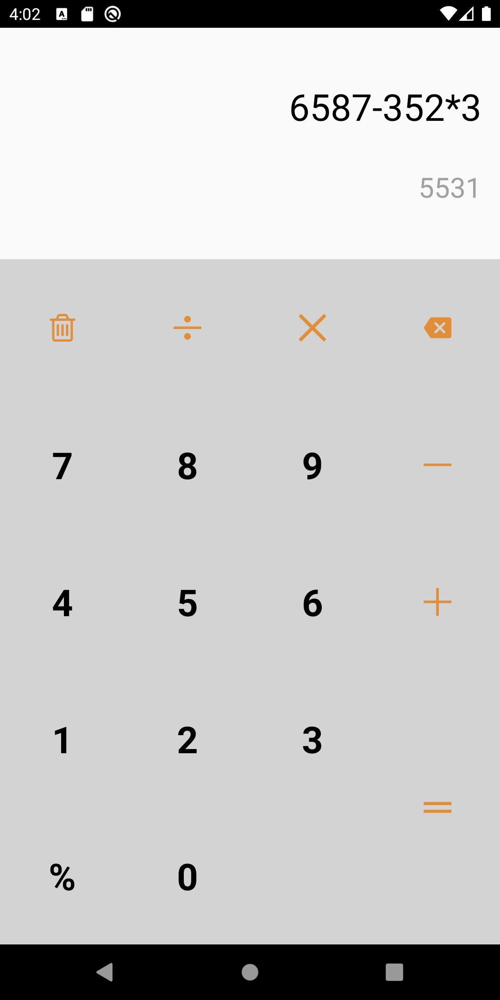
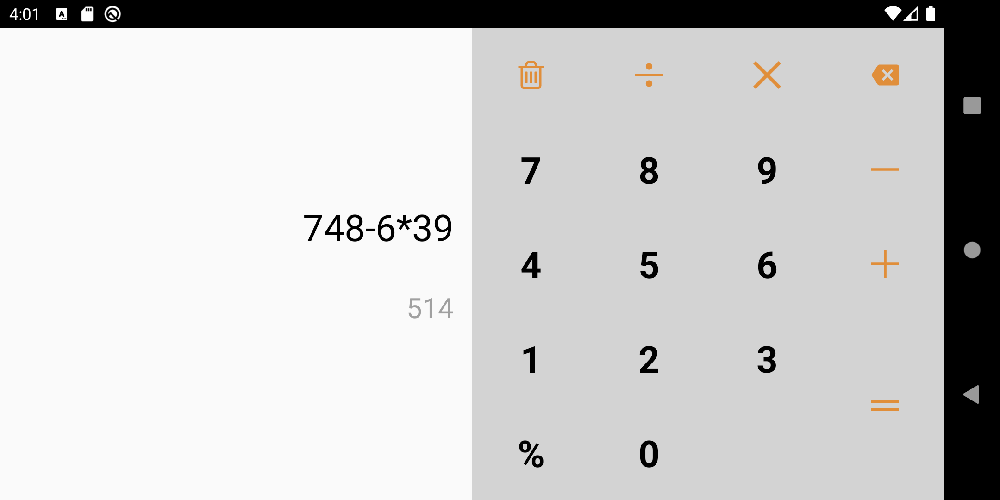

# Calculator_App
Basic calculator app created with Android Studio and Kotlin

## About

Basic calculator app created with Android Studio and Kotlin using MVP architecture. The app supports both portrait and landscape modes. 

## Portrait mode:

       
  
  
## Landscape mode:
 
 
